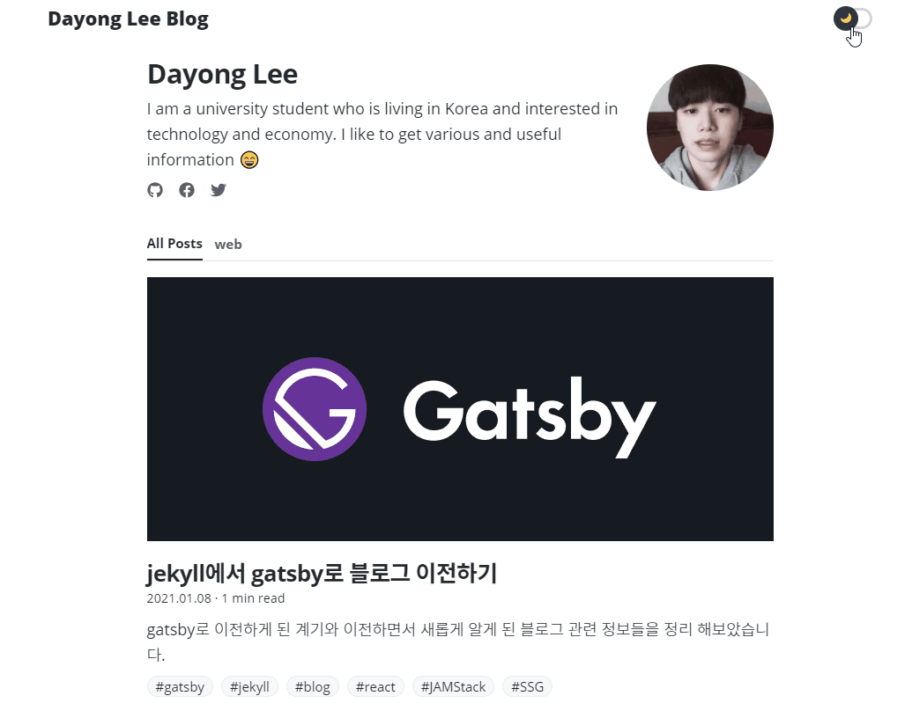
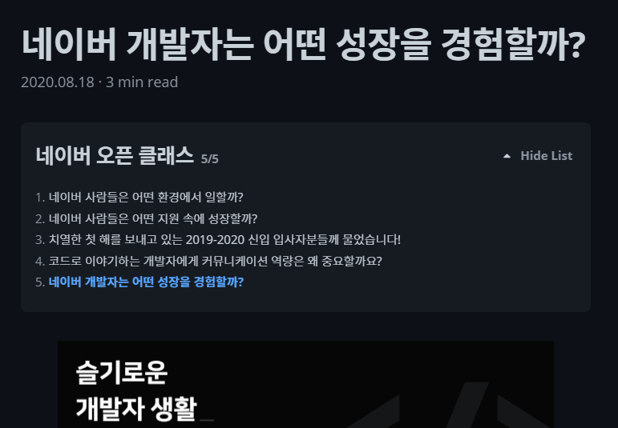
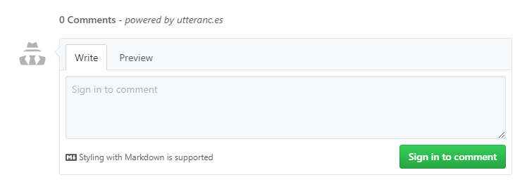
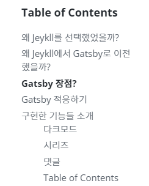
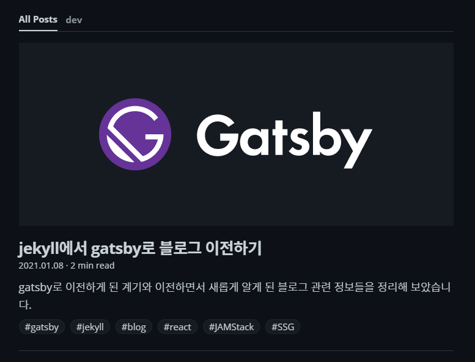
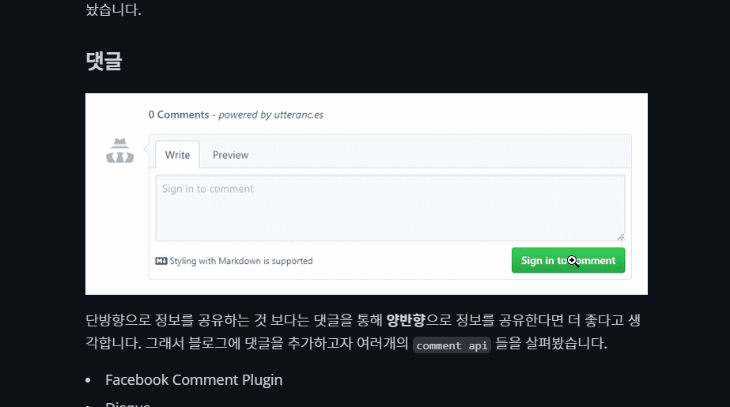

많은 개발자분들은 정보를 공유하고자 블로그를 운영하는 것을 볼 수 있습니다. 이런 부분이 `Software` 분야가 빠른 성장을 할 수 있게 도와준다고 생각합니다. 그래서 저 또한 조금이라도 기여하고자 블로그를 시작했었습니다.

## 왜 Jeykll를 선택했었을까?

처음에는 `Tistory`와 같은 블로그 플랫폼을 사용하여 글을 썼지만 `github.io`와 같은 도메인 너무 매력적이라서 `Github Pages`로 블로그를 이전하고 싶었습니다. 그래서 `Github Pages` 공식 홈페이지에서도 메인으로 나와 있고 테마도 더 다양한 것 같았던 `Jeykll`을 선택했었습니다.

## 왜 Jeykll에서 Gatsby로 이전했을까?

해커톤 및 프로젝트들이 끝나서 블로그에 이에 대한 후기를 남기려고 했으나 블로그를 다시 꾸미고 싶은 생각이 들었습니다. 하지만 `Jeykll`은 `Ruby`로 만들어진 `Static Site Generator(SSG)`이기 때문에 주로 `JS`를 사용한 저에게는 부담이 되었습니다. (입대가 한 달 정도 남아서 더 부담됐습니다) 그래서 기술 스택이 비슷했던 `Gatsby`를 사용하여 다시 블로그를 만들고자 마음을 먹게 되었습니다.

## Gatsby 장점?

- `React`, `Webpack`, `modern JavaScript`와 같은 최신 웹 기술들이 기본으로 지원한다.
- `headless CMS`, `SaaS services`, `API`, `databases`, `file system` 등과 같은 다양한 곳에서 데이터를 가져와 페이지에 넣을 수 있다.
- 정적 파일들로 빌드하기 때문에 다양한 서비스들로 **배포하기 쉽고 서버 비용을 걱정할 필요가 없다**.
- 페이지가 요청되었을 때 생성하는 것을 기다리지 않아도 되기 때문에 **빠른 로딩 속도**를 얻을 수 있다.
- `플러그인` 기능이 있어 다양한 기능들을 간단하게 추가할 수 있다.
- 초심자를 위해 `Gatsby Starter`와 같은 테마가 많이 있어서 이를 이용하면 손쉽게 사이트를 만들 수 있다.

이와 같은 장점들 외에도 사용하면서 많은 장점이 있었으나 당연히 최고의 장점은 **활성화된 커뮤니티**인 것 같습니다. 덕분에 필요한 기능들은 대부분 이미 플러그인으로 구현되어 있었고 만들면서 막히는 부분은 구글링으로 충분히 해결할 수 있었습니다.

## Gatsby 적응하기

처음부터 문서를 보지도 않고 기본적인 블로그 기능들이 갖춰진 `gatsby-starter-blog`를 먼저 클론했고 해당 파일들이 어떻게 구성되어 있는지 살펴보고 조금씩 수정해보면서 공부했습니다. 그러다가 모르는 부분이 생기면 문서나 구글링을 통해 부족한 부분을 채워나갔습니다. 이렇게 하면 초반부터 바로 결과물을 보면서 개발할 수 있어서 처음부터 **재미있게** 배울 수 있다고 생각합니다. 또한 **많은 사람이 끊임없이 고쳐낸** 파일 구조와 코드들을 볼 수 있기 때문에 **최신 기술들이나 좋은 코드 스타일**을 배울 수 있다고 생각합니다.

## 구현한 기능들 소개

디자인은 심플하고 트렌디하게 만들고자 했고 접근성과 유저 경험을 생각하면서 꼭 필요한 기능만을 추가하고자 노력했습니다.

### 다크모드

먼저 요즘 빼놓을 수 없는 기능 중 하나인 다크모드 입니다. `use-dark-mode`와 `gatsby-plugin-use-dark-mode` 라이브러리를 사용하여 body에 `light` 또는 `dark` 클래스를 추가해주고 `CSS Variables` 기능을 사용하여 해당 클래스(모드)에 맞게 색을 변경해주었습니다. 참고로 색들은 `Github` 및 `Primer`를 참고했습니다!

### 시리즈

보통 블로그에서는 **태그** 또는 **카테고리**를 사용하여 블로그를 분류합니다. 하지만 같은 카테고리 내에서 따로 분류하고 싶은 글들이 있다면 자식 카테고리를 생성하는 것보다는 **시리즈**로 나누는 것이 좋다고 생각해서 시리즈 기능을 추가했습니다. 위 사진과 같이 보고 있는 글이 어떠한 시리즈에 포함되어 있다면 시리즈의 목록을 상단에 보여줌으로써 **연관된 글들을 한눈에** 볼 수 있게 해놨습니다.

### 댓글

단방향으로 정보를 공유하는 것보다는 댓글을 통해 **양방향**으로 정보를 공유한다면 더 좋다고 생각합니다. 그래서 블로그에 댓글을 추가하고자 여러 개의 `Comment API` 들을 살펴봤습니다.

- Facebook Comment Plugin
- Disqus
- utterances

이외에도 많은 `Comment API` 가 존재하지만 보통 위 3개의 서비스를 가장 많이 사용합니다. 저는 그중에 가장 블로그 디자인과 어울렸고 로딩 속도도 비교적 빨랐던 `utterances`를 선택했습니다. `utterances`는 `Github issue seach API`를 사용하여 댓글을 저장하고 불러옵니다. 그래서 댓글을 남기려면 `Github` 계정이 필요하기 때문에 개발과 관련 없는 블로그에서는 비추천 드립니다!

### Table of Contents

`Table of Contents(TOC)`는 목차 기능으로 지금 어디 부분을 보고 있는지 또는 글의 구성을 한눈에 볼 수 있게 도와줍니다. `TOC`를 처음 적용했을 때에는 `window scroll event`를 이용했으나 `Gatsby`의 [공식 문서 코드](https://github.com/gatsbyjs/gatsby/blob/ae2c3dab9fe6b26a968b7762892243914ee10a6b/www/src/hooks/use-active-hash.js)를 살펴본 결과 `IntersectionObserver` 라는 API를 알게 되어서 이를 이용해 구현했습니다.

`Intersection Observer API`은 간단하게 설명하자면 `target element` 가 보인다면 `callback function` 이 실행되는 `API` 입니다. 자세한 내용은 [MDN 문서](https://developer.mozilla.org/en-US/docs/Web/API/Intersection_Observer_API)에 잘 나와 있습니다.

### 대표 이미지

아무래도 글보다는 사진이 한눈에 정보를 전달하기 좋다고 생각해서 대표 이미지 기능을 추가했습니다. 덕분에 링크의 미리 보기와 글 리스트에 대표 이미지를 표시할 수 있었습니다.

### 사진 확대

Medium과 같은 블로그 플랫폼을 보면 대부분 사진 확대 기능을 지원합니다. 하지만 gatsby는 기본적으로 지원하지 않기 때문에 `medium-zoom` 라이브러리를 통해서 사진 확대 기능을 추가했습니다.

## 만들면서 알게 된 정보들

- [Open Graph Protocol](https://ogp.me/)
  - 미리 보기 화면를 구성하는 메타 데이터의 표기 방법
- [emotion](https://emotion.sh/docs/introduction)
  - CSS in JS 라이브러리로 `css Prop` 기능이 대표적이다.
- [MDX](https://mdxjs.com/)
  - `Markdown` 문서에서 `JSX`를 원활하게 쓰기 위한 형식
- [JAMStack](https://jamstack.org/)
  - `Javascript`, `Api`, `Markup`로 구성된 스택으로 `pre render`를 하므로 빠른 로딩 속도가 빠른 것이 가장 큰 특징 중 하나입니다.
- [Headless CMS](https://en.wikipedia.org/wiki/Headless_content_management_system)
  - 콘텐츠를 생성, 저장, 관리하는 부분만을 담당하는 `CMS`로 대표적인 서비스로 [Contentful](https://www.contentful.com/) 이 있습니다.
- [Buy me a coffee](https://www.buymeacoffee.com/)
  - 기부 및 멤버십를 지원해주는 서비스로 커피를 사준다는 재미 요소가 들어 있는 것이 특징입니다.
- [CSS Variable](https://developer.mozilla.org/ko/docs/Web/CSS/Using_CSS_custom_properties)
  - 전용 표기법을 사용해 직접 정의하고 `var()` 함수를 사용하여 접근할 수 있다.

## 마무리

드디어 블로그 제작 및 후기 글 작성을 마쳤다. 개인 프로젝트라 확실히 최신 기술들을 적용하기 좋다는 것을 느낄 수 있었습니다. 그래서 앞으로도 새롭게 알게 되는 기술들은 블로그 또는 개인 프로젝트에 적극적으로 적용하려고 합니다. 하지만 앞으로 1년 6개월 동안은 입대로 인해 직접적인 개발은 어려울 것 같지만 글은 꾸준히 군대에서도 틈틈히 작성하려고 합니다. 지금까지 열심히 블로그를 만든 만큼 이제는 글을 열심히 작성해서 속을 채워야겠습니다.

감사합니다!

## 참고

- [gatsby-starter-yong](https://github.com/dayongbz/gatsby-starter-yong)
- [Gatsby Incremental Builds and Github Actions](https://raulmelo.dev/blog/cache-gatsby-github-actions)
- [JBEE.io](https://jbee.io/)
- [블로그 새단장 후기](https://imch.dev/posts/blog-renewal)
- [고오급 목차(Table of Contents)을 만들어보자](<https://whywhyy.me/blog/2020/06/10/%EA%B3%A0%EC%98%A4%EA%B8%89%20%EB%AA%A9%EC%B0%A8(Table%20of%20Contents)%EC%9D%84%20%EB%A7%8C%EB%93%A4%EC%96%B4%EB%B3%B4%EC%9E%90>)
- [Overreacted](https://overreacted.io/)
